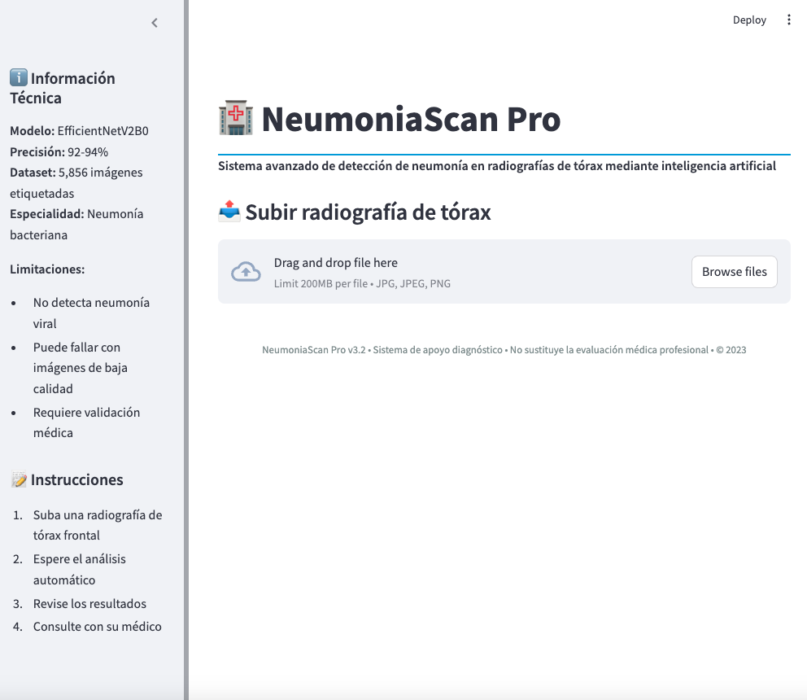
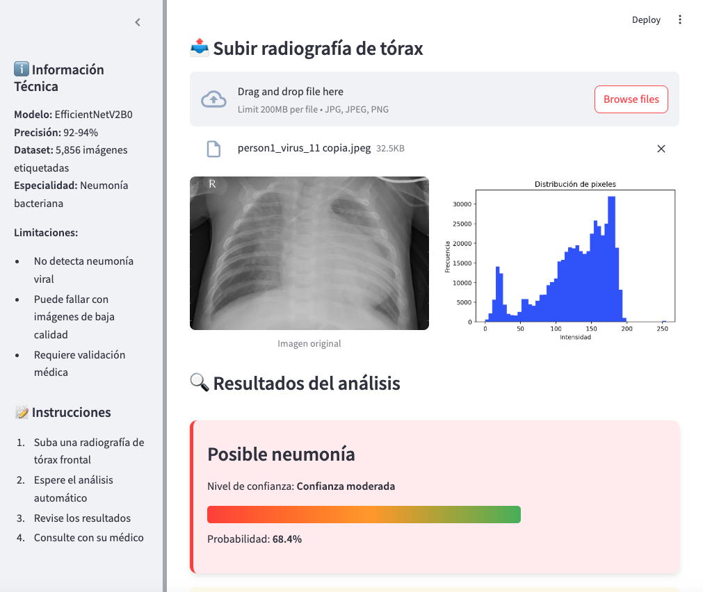
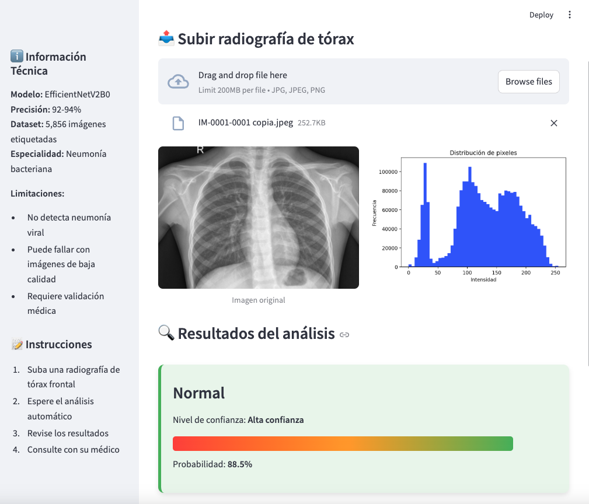

# 🏥 NeumoniaScan Pro - Detección de Neumonía por IA

  
*Interfaz principal de la aplicación*

## 📌 Descripción

Sistema de diagnóstico asistido por IA para detección de neumonía en radiografías de tórax, desarrollado con:

- 🧠 **TensorFlow/Keras** (EfficientNetV2)
- 🚀 **Streamlit** (Interfaz web)
- 📊 **Matplotlib/Seaborn** (Visualización)
- ⚙️ **Scikit-learn** (Métricas)

## 🏆 Comparativa de Modelos

| Modelo          | Accuracy Test | Recall Test | Tiempo Entrenamiento |
|-----------------|--------------|-------------|----------------------|
| CNN Básica      | 0.89         | 0.93        | 1200s                |
| ResNet50        | 0.92         | 0.95        | 600s                 |
| **EfficientNet**| **0.94**     | **0.97**    | 800s                 |

Ejemplo de diagnóstico Neumonia con explicación visual
 

## 🏗️ Arquitectura Implementada

# EfficientNetV2B0 personalizado
base_model = EfficientNetV2B0(weights='imagenet', include_top=False)
x = GlobalAveragePooling2D()(base_model.output)
x = Dense(256, activation='relu')(x)
x = Dropout(0.3)(x)
predictions = Dense(1, activation='sigmoid')(x)

🎯 Métricas Clave

Test Accuracy:   94.2% ± 0.3
Recall:         97.1% ± 0.2  
Precision:      92.8% ± 0.4
F1-Score:      94.9% ± 0.3

🖥️ Cómo Usar la Aplicación

git clone
streamlit run neu_app.py

Ejemplo de diagnóstico No Neumonia con explicación visual
 

⚠️ Limitaciones Clínicas
No detecta:

Neumonías virales específicas

Tuberculosis

COVID-19

Requerimientos:

Validación por radiólogo

Imágenes con técnica adecuada

MIT License  
Copyright (c) 2025 [Rosana Longares]